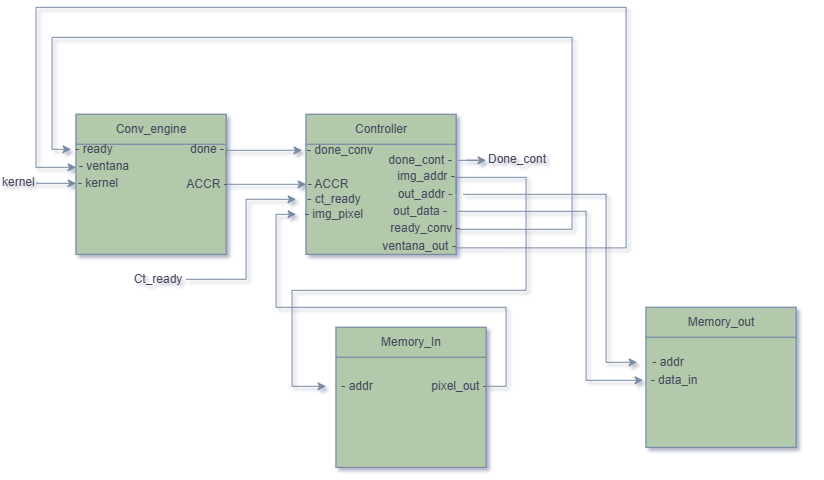
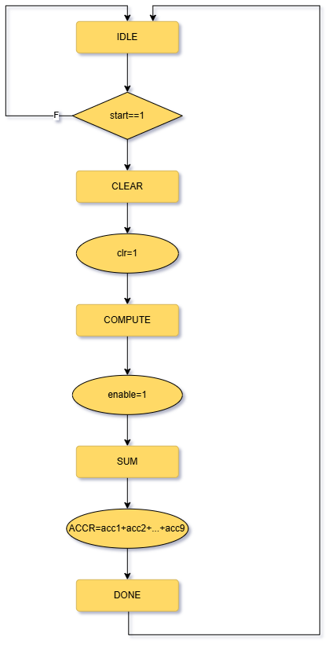
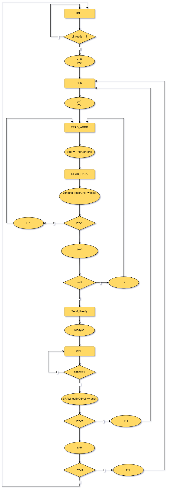

# 2D Convolution Accelerator (INT8, SystemVerilog)

A from-scratch 2D convolution hardware accelerator for CNN inference, designed in SystemVerilog using the ASMD (Algorithmic State Machine with Datapath) methodology, targeting the Xilinx Artix-7 FPGA on the Digilent Basys 3 board (`xc7a35tcpg236-1`).

The design performs INT8-quantized 3x3 convolution (Sobel edge detection kernel) on a real 28x28 MNIST digit image, end to end: symmetric INT8 quantization of the input, a fully pipelined MAC-based convolution engine, INT8 requantization of the output using round-half-to-even (banker's rounding), and storage of the 26x26 result in on-chip memory. The full datapath is verified bit-exact against a Python/NumPy golden model.

**Status:** simulation and synthesis/implementation complete in Vivado, targeting the Basys 3 part. Not yet deployed on physical hardware.

## Why this project

Built as a portfolio project for Digital Design / Verification roles, with a focus on demonstrating: ASMD-based FSM/FSMD design, INT8 quantization for edge AI inference, multi-level testbench verification (unit -> integration -> full-system bit-exact), and realistic FPGA synthesis/timing closure analysis (not just "it simulates").

## Architecture



```
Memory_In (784x8b ROM, image.mem)
        |
        v
   controller (FSM: gathers 3x3 window, drives conv_engine, writes result)
        |                                   ^
        v ventana[0:8]                      | ACCR
   conv_engine (FSM: IDLE/CLEAR/COMPUTE/DONE)
        |
        9x Mac_Unit (a*b accumulate, sync clr, async reset)
        |
        v ACCR (int32)
   requantizer (round-half-to-even, fixed scale=4 -> arithmetic shift >>>2)
        |
        v INT8
   Memory_out (676x8b RAM, write port from controller + independent read port)
```

### Module summary

| Module | Role | Verification |
|---|---|---|
| `Mac_Unit.sv` | Single multiply-accumulate cell (`acc <= acc + a*b`), sync `clr`, async `rst` | `tb_mac_unit.sv` — 212/212 PASS |
| `conv_engine.sv` | Instantiates 9 `Mac_Unit`s in parallel, ASMD FSM (`IDLE -> CLEAR -> COMPUTE -> DONE`) to clear/accumulate/sum a 3x3 window against the kernel | `tb_conv_engine.sv` — 102/102 PASS |
| `controller.sv` | Top-level orchestration FSM: sweeps the 26x26 output positions, reads the 3x3 pixel window from `Memory_In` (one BRAM read per state, 1-cycle latency), drives `conv_engine`, writes results to `Memory_out` | `tb_controller.sv` (standalone, `conv_engine` stubbed) — 676/676 PASS |
| `Memory_In.sv` | 784x8-bit input image ROM, loaded via `$readmemh("image.mem", ...)`, synchronous read | covered by `tb_top.sv` |
| `Memory_out.sv` | 676x8-bit output RAM with a write port (from `controller`) and an independent read port (for readback/observability) | covered by `tb_top.sv` |
| `requantizer.sv` | Requantizes the INT32 accumulator down to INT8 using round-half-to-even and saturation to [-128, 127] | covered by `tb_top.sv` |
| `top.sv` | Wires all of the above together, instantiates the fixed Sobel kernel as a `localparam` | `tb_top.sv` — 676/676 PASS, bit-exact vs. Python golden model |

### ASMD charts

| `conv_engine` FSM | `controller` FSM |
|---|---|
|  |  |

### Key design decisions

- **Two-tier memory (separate input ROM / output RAM):** deliberate, not an inefficiency — the input image is read-only during a pass and the output is write-once/read-later, so splitting them avoids arbitration logic and matches how the FPGA's dual independent BRAM ports are actually used.
- **BRAM read latency:** `Memory_In` has a 1-cycle synchronous read, so `controller` has a dedicated `READ_ADDR` state to present the address one cycle before the data is valid — this couldn't be optimized away, unlike `conv_engine`'s combinational `ACCR` sum.
- **2D-to-1D address flattening** is applied at three different scales: full image (`(r+i)*28 + (c+j)`, width 28), 3x3 window (`i*3 + j`, width 3), and output image (`r*26 + c`, width 26).
- **Fixed Sobel kernel** (`[-1,0,1,-2,0,2,-1,0,1]`) as a `localparam` array in `top.sv` — this accelerator is a fixed-function convolution engine, not a general/programmable one.

## Quantization scheme

The golden model (`sim/golden_model.py`) implements symmetric INT8 quantization:

```
scale = max(|x|) / 127
q = clip(round(x / scale), -128, 127)
```

applied twice: once to the input MNIST image, and once to the convolution output (the second pass is what `requantizer.sv` reproduces in hardware). For this specific image/kernel pair the output scale works out to exactly 4.0, which lets the division become a simple arithmetic right-shift by 2 (`>>> 2`) instead of a fixed-point reciprocal multiply — see "Known limitations" below for the caveat this introduces.

`requantizer.sv` implements **round-half-to-even** (not round-half-up), matching NumPy's `np.round` exactly: the low 2 discarded bits are checked as the remainder of the shift, and on an exact tie the result is rounded to whichever neighbor is even. This was necessary to reach bit-exact agreement with the Python model — round-half-up alone left 23/676 outputs mismatched on exact-tie cases.

## Verification results

| Level | Testbench | Result |
|---|---|---|
| Unit: MAC cell | `tb_mac_unit.sv` | 212/212 PASS |
| Unit: convolution engine (9x MAC + FSM) | `tb_conv_engine.sv` | 102/102 PASS |
| Integration: controller FSM (conv_engine stubbed) | `tb_controller.sv` | 676/676 PASS |
| Full system: real 28x28 MNIST digit, bit-exact vs. `golden_model.py` | `tb_top.sv` | 676/676 PASS |

`tb_top.sv` compares all 676 output memory locations (`dut.mem_write.mem[k]`) against `expected_output.mem`, generated independently by the Python golden model on a real MNIST test-set digit (a "7").

## Synthesis & implementation results

Target: Digilent Basys 3, part `xc7a35tcpg236-1` (Artix-7). Run in Vivado (Synthesis + Implementation), no physical hardware deployment yet.

| Resource | Used | Available | Utilization |
|---|---|---|---|
| LUT | 662 | 20,800 | 3.18% |
| FF | 264 | 41,600 | 0.63% |
| BRAM (tile) | 0.5 | 50 | 1.00% |
| DSP48 | 0 | 90 | 0% |
| IO | 22 | 106 | 20.75% |

### Timing closure

At the board's native 100 MHz (10 ns period), the real datapath's critical path (MAC accumulate -> `ACCR` sum -> `requantizer` -> `Memory_out` write) failed timing (WNS = -1.472 ns). The clock constraint was relaxed to **80 MHz (12.5 ns, `constraints/clockk.xdc`)**, which closes with WNS = +0.357 ns, all constraints met. Deploying on the real Basys 3 (fixed 100 MHz oscillator) would require either a clock divider / MMCM to generate 80 MHz, or an added pipeline register between `ACCR` and the requantizer to close timing at the full 100 MHz — see "Known limitations."

Two earlier synthesis pitfalls were diagnosed and fixed along the way (see commit history / notes): (1) with no observable output beyond a single `done` flag, Vivado's synthesis optimized the entire datapath away as dead code — fixed by exposing a `read_addr`/`read_data` readback port on `Memory_out`/`top`; (2) `image.mem` was only present in the Simulation Sources fileset, so `$readmemh` failed silently *during synthesis specifically* (`[Synth 8-4445]`) and the datapath was constant-folded away again — fixed by also adding it to Design Sources.

## Repository structure

```
rtl/            RTL source (Mac_Unit, conv_engine, controller, Memory_In, Memory_out, requantizer, top)
tb/             SystemVerilog testbenches for each verification level
sim/            Python golden model + generated .mem files (image, kernel, expected output)
constraints/    Vivado XDC clock constraint
Diagramas/      ASMD charts and block diagrams (design-time notes)
docs/           (reserved for waveform screenshots / synthesis report captures)
```

## Reproducing the results (Vivado)

1. Create a project targeting part `xc7a35tcpg236-1`.
2. Add `rtl/*.sv` as **Design Sources**.
3. Add `sim/image.mem` as **both** a Design Source and a Simulation Source (synthesis needs it too, since `Memory_In` is initialized via `$readmemh`; `sim/kernel.mem` is not used at the RTL level — the kernel is a hardcoded `localparam` in `top.sv`).
4. Add `tb/*.sv` and `sim/expected_output.mem` as **Simulation Sources**.
5. Add `constraints/clockk.xdc` as a **Constraint**.
6. Run `tb_top` behavioral simulation — expect `676 PASS, 0 FAIL`.
7. Run Synthesis then Implementation; check Report Utilization (Hierarchy) and Report Timing Summary against the tables above.

To regenerate the `.mem` files from scratch: `python sim/golden_model.py` (requires `numpy`, `torchvision`).

## Known limitations / future work

1. **Fixed output scale.** `requantizer.sv` hardcodes `scale = 4.0` (as an arithmetic shift by 2), precomputed in Python for this specific image/kernel pair. It is not a general dynamic requantizer — a different input image could produce a different max-magnitude output and would need a different scale/shift.
2. **No DSP inference.** `Mac_Unit.sv` uses an **asynchronous** reset on its accumulator. DSP48E1 slices only support a synchronous reset on their internal accumulator, so Vivado maps all 9 MAC units to LUT logic instead of DSP48 slices (0 DSPs used, 662 LUTs instead). Switching to a synchronous reset would let synthesis map the MACs onto DSP48 slices, freeing LUTs.
3. **Real deployment needs a clock divider.** The Basys 3's onboard oscillator is fixed at 100 MHz; this design closes timing at 80 MHz. Physical deployment would need an MMCM/PLL-based clock divider, or a pipeline register added between `ACCR` and `requantizer` to close timing at the full 100 MHz instead.
4. **Faster architectures, documented but not implemented:**
   - A fully combinational `conv_engine` (dropping the internal FSM entirely), since the 9 MACs already operate in parallel and the FSM mostly just sequences 3 fixed cycles.
   - Pipelining the BRAM address/data read in `controller` (overlapping `READ_ADDR`/`READ_DATA` across window-pixel iterations instead of paying the 1-cycle latency 9 times per window).
   - A line-buffer / sliding-window architecture that avoids re-reading pixels shared between adjacent 3x3 windows (up to ~4x fewer memory reads per output pixel).
5. **Minor cleanup:** the FSM `case` statement in `controller.sv` has no `default` branch (Vivado emits a `Synth 8-155` advisory, though the `enum` is exhaustively covered) — adding one is good practice.

## Data flow example

Input: a real 28x28 MNIST test-set image (digit "7"), quantized to INT8. Kernel: 3x3 Sobel (`[-1,0,1; -2,0,2; -1,0,1]`), applied in "valid" mode (no padding) to produce a 26x26 output, quantized back to INT8 and written to the 676-entry output memory.
