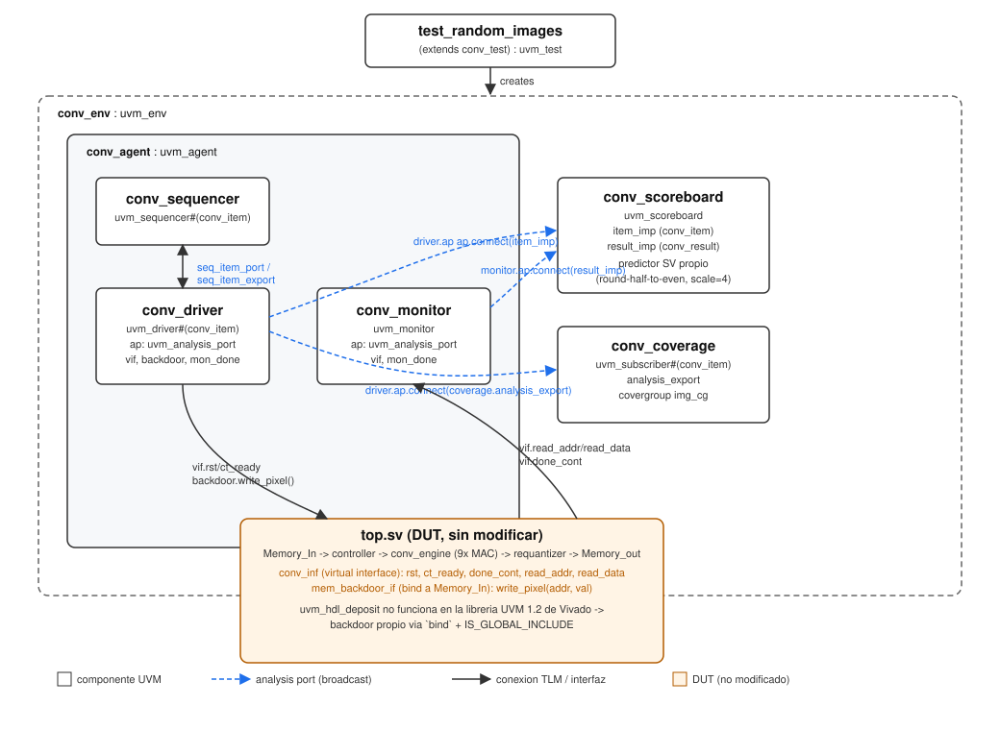

# UVM Verification Environment for the 2D Convolution Accelerator

A full UVM (Universal Verification Methodology) testbench built around the [2D Convolution Accelerator](../2D_Convolutional_Accelerator) DUT, without modifying a single line of the RTL. Built as a second, complementary portfolio project to demonstrate industry-standard verification methodology (constrained-random stimulus, a self-checking scoreboard with its own reference model, functional coverage) on top of an already-verified design.

**Status:** functional. Full random-regression (20 constrained-random images + 1 directed edge case) passes bit-exact against a self-built SystemVerilog predictor: **14196/14196 PASS, 0 FAIL**. Functional coverage: **77.78%** (see "Functional coverage" below for the remaining gap and why it's structurally hard to close with random stimulus alone).

## Why this project

The [2D_Convolutional_Accelerator](../2D_Convolutional_Accelerator) project demonstrates RTL design (ASMD methodology, FSMD, INT8 quantization) verified with a traditional directed testbench (one golden-model file, one comparison, one simulation run). This project takes the *same, unmodified* DUT and re-verifies it with a proper UVM environment, to demonstrate the verification methodology that FPGA/ASIC verification roles specifically look for: reusable, layered testbench components; constrained-random stimulus generation; a scoreboard with an independent reference model; and functional coverage to measure *what* has actually been exercised (as opposed to just "it ran without errors").

## Architecture



`uvm_conv_tb_top` instantiates the DUT (`top.sv`, unmodified) plus a `conv_inf` virtual interface and a `mem_backdoor_if` (see "Backdoor loading" below), sets both into `uvm_config_db`, and calls `run_test()`. From there, everything is standard UVM:

```
test_random_images / test_edge_cases (uvm_test)
  -> conv_env (uvm_env)
       -> conv_agent (uvm_agent)
            -> conv_sequencer   : uvm_sequencer#(conv_item)
            -> conv_driver      : uvm_driver#(conv_item)     -- drives vif + backdoor, ap -> broadcasts each input item
            -> conv_monitor     : uvm_monitor                -- samples vif, ap -> broadcasts each output result
       -> conv_scoreboard  : uvm_scoreboard                  -- receives both streams, predicts, compares
       -> conv_coverage    : uvm_subscriber#(conv_item)      -- receives the input stream, samples a covergroup
```

### Component summary

| Component | Role |
|---|---|
| `conv_item.sv` | Input transaction: 784 randomizable signed 8-bit pixels (one 28x28 image) |
| `conv_result.sv` | Output transaction: 676 signed 8-bit pixels (the 26x26 convolution result) |
| `conv_inf.sv` | Virtual interface bridging class-based UVM code to the DUT's pins (`rst`, `ct_ready`, `done_cont`, `read_addr`, `read_data`) |
| `conv_sequencer.sv` | Arbitrates transactions between sequences and the driver |
| `conv_driver.sv` | Loads each image into the DUT via the backdoor, pulses `rst`/`ct_ready`, waits for `done_cont`, broadcasts the input item on its analysis port |
| `conv_monitor.sv` | Reads back all 676 output pixels through `read_addr`/`read_data`, broadcasts the result on its analysis port, raises/drops its own objection around the capture window |
| `conv_agent.sv` | Bundles driver + sequencer + monitor, wires `seq_item_port`/`seq_item_export` |
| `conv_env.sv` | Bundles the agent, scoreboard and coverage collector; wires both analysis ports |
| `conv_random_seq.sv` | Generates one fully-randomized image per `body()` call |
| `all_zero_seq.sv` | Directed sequence: forces all 784 pixels to 0 (edge case, unreachable by pure random stimulus) |
| `conv_scoreboard.sv` | Self-built SystemVerilog reference model that replicates the DUT's *actual* fixed-scale (scale=4, round-half-to-even) requantization, compared pixel-by-pixel against the monitor's output |
| `conv_coverage.sv` | Functional coverage: `covergroup` over max pixel value, min pixel value, and whether the image is all-zero |
| `conv_test.sv` | Base test: builds `conv_env`, runs a single random image |
| `test_random_images.sv` | Extends `conv_test`; runs `num_images` (default 20) random images plus the all-zero directed case, all inside one simulation so coverage accumulates |
| `test_edge_cases.sv` | Extends `conv_test`; runs only the all-zero directed sequence, in isolation |
| `mem_backdoor.sv` | `bind`-based backdoor interface into `Memory_In`, used to load pixels without touching the DUT (see below) |
| `uvm_conv_tb_top.sv` | Top-level module: instantiates the DUT and interfaces, configures `config_db`, calls `run_test` |

### Backdoor loading: a Vivado XSim limitation

The standard UVM way to force values into internal DUT memory is `uvm_hdl_deposit()` / the `uvm_reg` backdoor DPI routines. Vivado's precompiled UVM 1.2 library ships with those DPI routines **compiled off** (`UVM_FATAL [UVM_HDL_DEPOSIT] uvm_hdl DPI routines are compiled off`) — this is a fixed limitation of that specific distribution, not something fixable from testbench code. The workaround: a small interface (`mem_backdoor_if`) with a `ref` port directly into `Memory_In`'s array, injected via SystemVerilog's `bind` construct — so the DUT source is never touched, but the class-based driver gets a handle it can write through. Vivado's automatic compile-order/dependency scanner does not recognize `bind` as a reference, so the file additionally needs its `IS_GLOBAL_INCLUDE` property set, or it silently gets excluded from compilation.

## A real bug this methodology caught

Running a single image at a time (`conv_test`, `test_edge_cases`) always passed cleanly. The first attempt at `test_random_images` (looping 20 images in one simulation) produced **12791 mismatches** — not because the DUT or the scoreboard's predictor were wrong, but because of a genuine race condition only a multi-transaction regression could expose: the driver started loading the *next* image (asserting `rst`, writing pixels via the backdoor) before the monitor had finished reading out all 676 output pixels of the *previous* image, corrupting the read. The failure signature was diagnostic on its own: mismatch counts landed at exact multiples of 676 (`19 x 676 = 12844`), and the very last image of the run always passed 100%, since it was the only one with no following image to race against.

Fix: a `uvm_event` (`mon_done`), triggered by the monitor after it finishes its 676-pixel read loop, and waited on by the driver right after `item_done()` — connected between the two via a plain handle assignment in `conv_agent`'s `connect_phase` (no `config_db` needed, since the agent already owns both). After the fix: **14196/14196 PASS, 0 FAIL** across all 21 images in a single run.

## Verification results

| Test | Stimulus | Result |
|---|---|---|
| `conv_test` | 1 random image | 676/676 PASS |
| `test_edge_cases` | 1 directed image, all pixels = 0 | 676/676 PASS |
| `test_random_images` | 20 random images + 1 directed all-zero image | 14196/14196 PASS, 0 FAIL |

The scoreboard (`conv_scoreboard.sv`) is a from-scratch SystemVerilog predictor that reimplements the DUT's *actual* requantization behavior (fixed `scale = 4`, round-half-to-even), not an idealized/dynamic-scale golden model — this was a deliberate design decision, since the DUT itself hardcodes the scale (see the [original project's known limitations](../2D_Convolutional_Accelerator#known-limitations--future-work)), and comparing against a dynamic-scale model would produce false failures on every random image.

## Functional coverage

`conv_coverage.sv` defines a `covergroup` with three coverpoints, each meant to sample something about the *input* image distribution:

| Coverpoint | Bins | Covered |
|---|---|---|
| `cp_max` (max pixel value) | negative / zero / positive | zero, positive |
| `cp_min` (min pixel value) | negative / zero / positive | negative, zero |
| `cp_all_zero` (whole image is 0) | yes / no | yes, no |

Final result: **77.78%** ((66.7% + 66.7% + 100%) / 3).

The remaining two bins (`cp_max = negative`, `cp_min = positive`) require an image where **all 784 pixels** are negative, or all positive, respectively — with uniform random stimulus, the probability of that happening by chance is astronomically small, no matter how many random images are generated. Closing them would need two more directed sequences (`all_negative_seq`, `all_positive_seq`), analogous to `all_zero_seq`; not implemented here, left as a documented next step. This is itself a useful illustration of *why* functional coverage matters: it precisely quantifies what constrained-random stimulus can and cannot reach on its own, and where directed test cases are structurally necessary.

## Repository structure

```
tb/             UVM testbench sources (uvm_conv_tb_top.sv + all classes listed above)
Diagramas/      UVM hierarchy diagram
```

> **Note:** all files above were developed and validated directly inside the Vivado project (`UVM_Conv_Accelerator.srcs/sim_1/new/`). Only `hello_test.sv`/`hello_tb_top.sv` (the initial UVM/XSim sanity check) have been copied into this repository folder so far — the rest of the `.sv` files listed in the component table above still need to be copied over from the Vivado project into `tb/` for the repository to be self-contained.

## Reproducing the results (Vivado)

1. In the same Vivado project as the original accelerator (or a new one targeting the same part), add `2D_Convolutional_Accelerator/rtl/*.sv` as Design Sources (DUT, unmodified).
2. Add all files from `tb/` as Simulation Sources.
3. Set `mem_backdoor.sv`'s `IS_GLOBAL_INCLUDE` file property (Source File Properties, or the `Global Include` entry under the Hierarchy view) — required for the `bind` statement to be picked up.
4. Set `uvm_conv_tb_top` as the simulation top module.
5. In `uvm_conv_tb_top.sv`, keep `` `include "test_random_images.sv" `` and `run_test("test_random_images")` (swap for `test_edge_cases`/`conv_test` to run a different scenario).
6. Launch simulation and run `run -all` in the Tcl console (a full regression takes ~3.4 ms of simulated time, well past XSim's default fixed-duration run).

## UVM vs. the traditional testbench

The [2D_Convolutional_Accelerator](../2D_Convolutional_Accelerator) project's `tb_top.sv` is a directed, single-file testbench: one real MNIST image, one Python golden-model reference computed offline, one comparison loop, one pass/fail count. It is simple, fast to write, and sufficient to validate the datapath once. This project re-verifies the same DUT with a layered UVM environment instead:

| | Traditional (`tb_top.sv`) | UVM (this project) |
|---|---|---|
| Stimulus | 1 fixed image, precomputed offline | Constrained-random (`conv_random_seq`) + directed edge cases (`all_zero_seq`), easy to add more scenarios or loop N images |
| Reference model | Python/NumPy script, run once offline, output saved to a `.mem` file | Live SystemVerilog predictor in the scoreboard, computed and compared in-simulation, image by image |
| Reusability | Testbench is tied to one specific image/expected-output pair | Same environment (driver/monitor/scoreboard/coverage) reused unchanged across every test and every image |
| Coverage visibility | None — "676/676 PASS" says the one tested image worked, nothing about what was and wasn't exercised | Functional coverage quantifies exactly which input classes (sign of max/min, all-zero) have been exercised |
| Extensibility | Adding a new scenario means regenerating a new `.mem` pair with the Python model | Adding a new scenario means writing one new `uvm_sequence` |
| Found a real bug via methodology itself | No — a single fixed run has no notion of back-to-back transactions | Yes — the driver/monitor race was only observable once transactions were run back-to-back, which is exactly what a random-regression loop is for |
| Effort / setup cost | Low — one testbench file, no framework | Significantly higher — a dozen classes, a full class hierarchy, config_db plumbing, a home-built backdoor workaround |

Neither approach is "better" in an absolute sense: the traditional testbench was the right tool to validate the RTL once, cheaply. The UVM environment is the right tool when the same DUT needs to be re-verified repeatedly, under many input scenarios, with visibility into what has actually been tested — which is the normal expectation in professional ASIC/FPGA verification teams, and the specific gap this project was built to close.

## Known limitations / future work

1. **Coverage not closed to 100%.** Two directed sequences (all-negative, all-positive image) would close the remaining `cp_max`/`cp_min` bins; not implemented (see "Functional coverage" above).
2. **Repository not yet self-contained.** Most `.sv` files still live only in the local Vivado project and need to be copied into `tb/` (see "Repository structure" above).
3. **No `test_smoke`.** `conv_test` already serves that role (single quick random image); a dedicated smoke test was considered redundant and not built separately.
4. **Single simulator validated.** Only Vivado XSim (UVM 1.2) has been used; QuestaSim's Starter Edition license blocks `randomize()` (`svverification` restriction), so it was not a viable alternative for this project.
